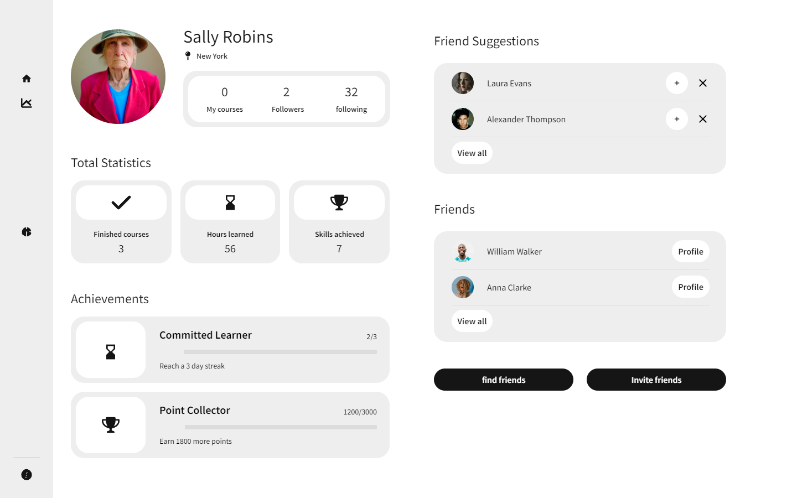

CS 3100 Project Proposal

By Abhijeet Singh

202032678

Description

This web app(StockMaster) serves as a stock trading simulator and provides a simplistic, light, and interactive environment for the best user experience. The basic idea behind the game is to maximize profits (virtual currency) within a set duration of time through accurate real-time prediction of financial markets(New York stock exchange). The Stock Exchange data will be pulled in real time through use of APIs to keep the simulation as real as possible. This will accomplish two major goals - First, to provide the player with an opportunity to partake in NYSE without risking actual money; Secondly, to allow the player to learn about financial markets, and the factors that affect them, in a competitive manner. This will ensure maintenance of a virtual socio-psychological stake to keep the game interesting. This will be done through introduction of leaderboards, and player rankings.

Note(for Admins and investors) - The Beta will feature inclusion of BuySell options only and additional environment variability will be introduced as the development process continues. The players will start with a fixed amount of virtual currency. More of this currency can be bought once it's been depleted. This monetization design strategy is to be deployed when our product has penetrated the market and acquired a certain market share amongst its competitors. This monetization will allow the developers to keep the app running for free. Additional plans to introduce definitions, strategies, effects of real-world factors are kept in mind and will be implemented in version 1.0

Moreover, the monetization and therefore competitive strategies can be made more efficient through introduction of paidunpaid courses to increase player participation and competitiveness. These are of course, subject to change as the game is currently in its design phase.

Screen Diagrams UI Design

A simplistic example of user interface is shown below, this proposed design doesn't necessarily includeexclude all the features listed in the next section.

1. The login page

2. Notifications Page

A general menu sidebar(left) allows to travel seamlessly between different pages.

A right sidebar for notifications page to filter notifications, and updates for prioritising workflow.

3. Main page for workflow.

Top Includes possible client management option to finance on behalf of other players to simulate the role of a financial stock portfolio manager, additional sidebar(right) to view feedback from the clients. If no clients, then shows personal earnings and portfolio growth.

Mid Stock portfolio growth over certain duration, with option to select a specific stock.

Bottom Option to include tips, strategies, courses, tutorials from as the admin sees fit.

Bottom Right tracking of popular stocks being bought currently.

Navigation Bar(top center wide)  quick access to search stocks, notifications, myProfile, buysell, chats etc.

4. My Profile tracking personal progress on courses, hours dedicated, friend requests and recommendations, virtual awardsachievements like on steam.

5. Portfolio Page Tracking transactions, stocks owned, sold, current inventory and its current value, overall change in value etc.

Planned Features

 ID  Name  Access by  Description  Expected implementation  Source of Idea 
 ---  ---  ---  ---  ---  --- 

1.
  login  Playeradmin  User profile login  Must  Common sense 

1.
  User login database  admin  Database of users  Must  Common sense 

1.
  Password recovery  Playeradmin  Password recovery mechanism  Must  Common sense 

1.
  Menu Sidebar  player  To travel between diff pages  Must  Common sense 

1.
  Home  Player  Homepage  Must  Observing angel1 app 

1.
  Portfolio  player  Portfolio page  Must  Observing angel1 app 

1.
  Leaderboard  Playeradmin  Regional global leaderboards  Must  Observing angel1 app 

1.
  watchlist  Player  Selected Stocks at the top for ease  not required  Observing angel1 app 

1.
  news  player  Current financial newsnot needed for beta  Not required  Observing angel1 app 

1.
  Analytics  player  Game currency analytics  Must  Common sense 

1.
  Transactions  player  All transactions  Must  Common sense 

1.
  Statements  player  Current and past statements  Must  Common sense 

1.
  Navigation Bar  player  For finer user experience  Must  Common sense 

1.
  Search bar  player  Search stocks  must  Common sense 

1.
  Chat  players  Pvp interaction  Not required but preferred  Existing apps like angel 1 

1.
  Notifications  player  User notifications  Important  Common sense 

1.
  Notification Filter  player  Ease of use for user  preferred  Recommended by ChatGPT 

1.
  User Client management  player  Extra feature for roleplaying financial manager  Not required  Me 

1.
  Client management grouping  player  Client database  Not required  Me 

1.
  Stock view  player  View current and past stock data  Must  obvious 

1.
  Popular stocks  Player  Current popular stocks  Must  ChatGPT 

1.
  Tips, courses  Playeradmin  To educate users  Not required, preferred  ME 

1.
  Personal achievemnts  player  User gratification  preferred  Steam 

1.
  Followers following  player  User connectivity interactions  preferred  Instagram 

1.
  Friend suggestions  player  For better user experience  Preferred  Instagram 

1.
  Transactions CSV file  player  Tracking and downloading transaction data  Important  Bank systems 

1.
  Total owned stock value  player  Total held stock value  Important  Angel1 

1.
  Current balance  player  Current liquid currency available  Important  Angel1 

1.
  Help and support  Playeradmin  User support  Important  Common sense 

1.
  Percentage updown  player  Data visualization  important  Common sense 

1.
  Trading duration options  player  Intraday monthly etc. level(risk) selection  Important  Common sense 

TOOLS and Packages

- Frontend HTML, CSS, JavaScript, React.js
- Backend Node.js, Express.js
- Database MongoDB
- Stock API Integration Alpha Vantage API

APP API

POST register

Description Registers a new player for the game.

Parameters Player's username, password, email (optional).

Response Success or failure message.

POST login

Description Logs in an existing player.

Parameters Player's username and password.

Response Authentication token or error message.

GET playerusernameportfolio

Description Retrieves the current portfolio of a player.

Parameters Player's username.

Response Player's portfolio details including stocks held and cash balance.

POST playerusernamebuy

Description Executes a buy action for a player.

Parameters Player's username, stock symbol, quantity.

Response Success or failure message.

POST playerusernamesell

Description Executes a sell action for a player.

Parameters Player's username, stock symbol, quantity.

Response Success or failure message.

GET admingames

Description Retrieves the list of ongoing games for admins.

Parameters None.

Response List of game details including startend dates and players.

POST admingamescreate

Description Creates a new game.

Parameters Game name, duration, initial cash amount.

Response Success or failure message.

GET admingamesgameId

Description Retrieves details of a specific game for admins.

Parameters Game ID.

Response Game details including players and their portfolios.

POST admingamesgameIddeclareWinner

Description Declares a winner for a specific game.

Parameters Game ID, winner's username.

Response Success or failure message.

GET adminplayers

Description Retrieves the list of all players for admins.

Parameters None.

Response List of player details including username and portfolio value.

Attributions

- Uizard for developing the UI images
- ChatGPT for general help and help with APP API section
- Sumesh(friend currently dealing with stock market)
- Google Search

[def]: Hom